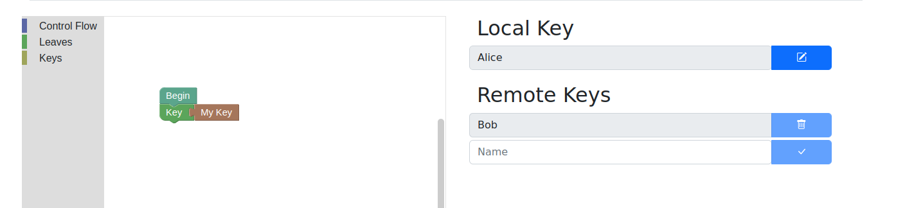
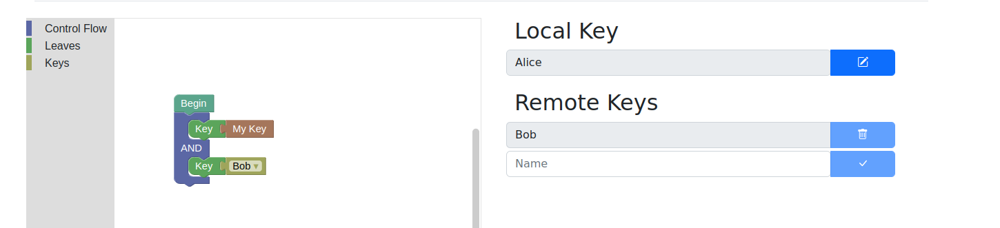
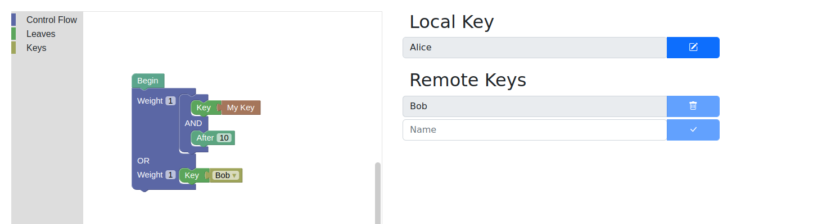
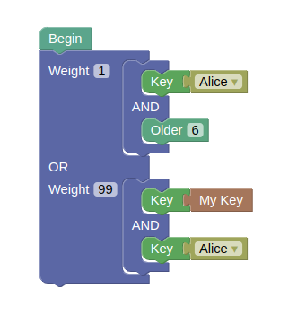
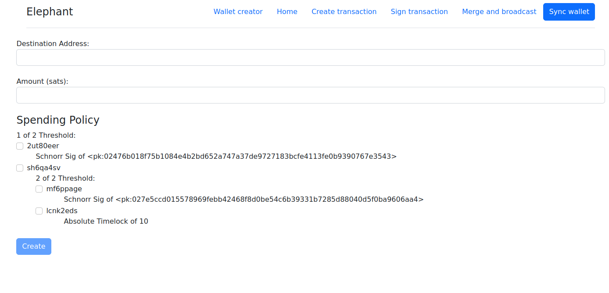
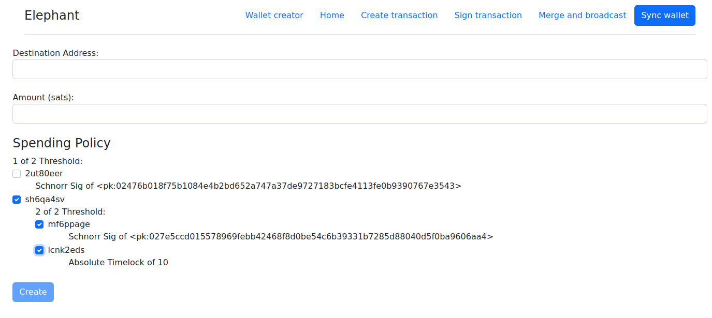
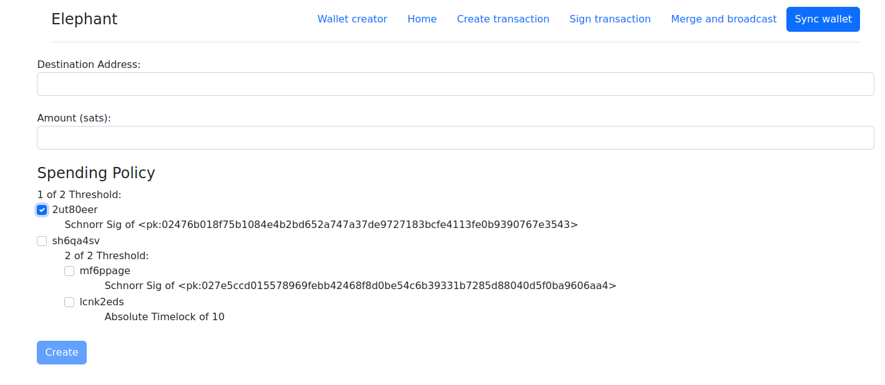

# Elephant (workshop)

Elephant is a Bitcoin Wallet designed to demonstrate the power of Bitcoin policies in a sandbox environment.

See it live at https://elephant.bitcoindevkit.org

**DO NOT USE IN PRODUCTION, YOU WILL LOSE YOUR MONEY!**

## FAQs

### Why?

We ([@danielabrozzoni](https://github.com/danielabrozzoni), [@afilini](https://github.com/afilini), [@evanlinjin](https://github.com/evanlinjin), [@rajarshimaitra](https://github.com/rajarshimaitra)) created this wallet for a workshop in Bangkok, at the BOB space. The crowd wasn't too technical, and we thought this could be a good way to show what kind of complicated wallets Bitcoin supports.

[The workshop was a success](https://twitter.com/PlebPiccoloJr/status/1601612531831025665), and so we decided to publish our work so that others may practice and play with it. Have fun!

### I want to use this with my friends

You can set up a spreadsheet like this one:
https://docs.google.com/spreadsheets/d/1EicpoBpHOTbvHx0yhUYlkv43kQEYLPLn0kbj7mr0UL4/edit?usp=sharing

Instructions included!

### I feel lost.

No worries, it's normal. Start by creating a wallet in the "Wallet creator" tab!

Here's some inspiration:

A single sig:


A 2of2 between you and Bob:


A wallet where either Bob spends, or you after block 10:


### I can't switch tab, I'm stuck in the "Wallet creator"


The tabs unlock once you have created a valid wallet in the "Wallet creator". Make sure that each branch has at least a key, and that you don't have duplicated keys!

Example of an invalid wallet (the key "Alice" is used more than once):



### Where's my seed?

There's no seed to backup. Let us explain.

Normally, when creating a multiparty wallet, each participant has to share their public key with the others. This is a crucial step in real world scenarios, but here, in a wallet built solely for education purposes, we felt that it would have been a burden. We wanted to build something that people could use for experimenting and for gaining a better understanding of Bitcoin policies, not something that would be used with real funds, and for this reason, we prioritized UX over security.

Each participant's key is deterministically generated from their alias. This has a few implications:
- You don't need to share keys for creating a multisig: as long as others know which alias you used, they can insert it in the system and automatically have your public key.
- This is really insecure, and any attempt of using this wallet in mainnet will result in funds loss.
- If you use popular aliases, you might open someone else's wallet! :)

### Does this wallet use Taproot?

Yes, it does. The policy you create in the "Wallet creator" tab gets compiled in a descriptor like:
```
tr(dummy_internal_key_unspendable, {your_policy})
```

### What's the "Spending policy" in the "Create transaction" tab?

Each Bitcoin wallet has a certain policy, which dictates how the wallet's funds can be spent. In the "Wallet creator" tab you're just creating a policy - Elephant compiles it automatically to obtain a descriptor.

The wallet needs to know which branch of your wallet's policy will be used for spending the coins, at the time of the creation of the transaction. The reasoning is that some policies might require BDK to create the transaction in a different way - for example, if you intend to spend with a locktime, BDK has to know, so that it can set the "nLockTime" (or "nSequence") field(s) of the transaction to the right value.

For example, let's say you have this policy, and this "Create transaction" tab:




If you intend to spend using "Me and the timelock", you have to select the appropriate branch:



Instead, if you intend to spend using Bob's branch, you have to set it accordingly:



## Development

### Installation

If you don't already have it installed, it's time to install Rust: <https://www.rust-lang.org/tools/install>.
The rest of this guide assumes a typical Rust installation which contains both `rustup` and Cargo.

To compile Rust to WASM, we need to have the `wasm32-unknown-unknown` target installed.
If you don't already have it, install it with the following command:

```bash
rustup target add wasm32-unknown-unknown
```

Now that we have our basics covered, it's time to install the star of the show: [Trunk].
Simply run the following command to install it:

```bash
cargo install wasm-bindgen-cli
cargo install --git https://github.com/thedodd/trunk.git trunk
```

That's it, we're done!

### Running

```bash
trunk serve
```

Rebuilds the app whenever a change is detected and runs a local server to host it.

There's also the `trunk watch` command which does the same thing but without hosting it.

### Release

```bash
trunk build --release
```

This builds the app in release mode similar to `cargo build --release`.
You can also pass the `--release` flag to `trunk serve` if you need to get every last drop of performance.

Unless overwritten, the output will be located in the `dist` directory.

[trunk]: https://github.com/thedodd/trunk
